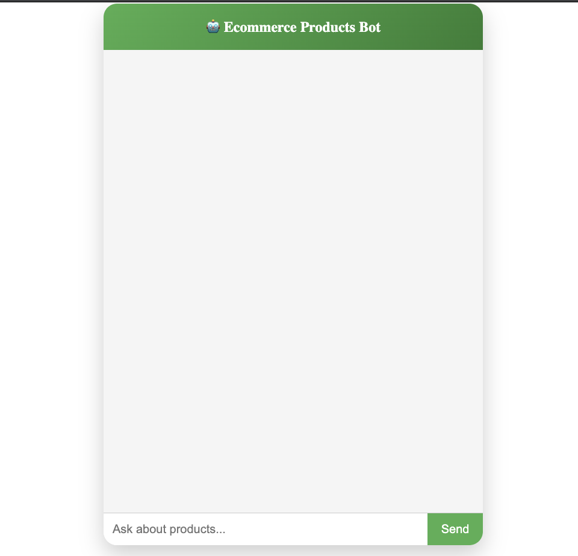

# AI Assistant Bot

An intelligent document search and analysis agent powered by Google's Agent Development Kit (ADK) and Gemini 2.5 Flash.



## Features

- **Document Search**: Search through PDF documents and Apple Pages files in `data/pdfs/`
- **OCR & Image Analysis**: Extract text from images in `data/images/` using pytesseract
- **Link Extraction**: Automatically detect and extract URLs from text
- **Web UI**: Interactive development UI at `http://127.0.0.1:8000/dev-ui/`
- **REST API**: FastAPI endpoint for programmatic access

## Architecture

```
ai-assistant/
├── ai_bot/                    # AI agent module
│   ├── agent.py              # Main agent configuration
│   └── __init__.py
├── data/
│   ├── pdfs/                 # PDF and .pages documents
│   └── images/               # Images for OCR
├── tools.py                  # Search tools (PDFs, images, links)
├── main.py                   # FastAPI server
└── requirements.txt          # Dependencies
```

## Installation

### Prerequisites
- Python 3.9+
- Virtual environment manager (venv)
- Tesseract OCR (for image processing)

### Setup

1. **Clone and navigate to the project:**
```bash
cd /Users/gaurav/ai-assistant
```

2. **Create and activate virtual environment:**
```bash
python3 -m venv .venv
source .venv/bin/activate
```

3. **Install dependencies:**
```bash
pip install -r requirements.txt
```

4. **Set API key:**
```bash
export GOOGLE_API_KEY="your-api-key-here"
```

## 🚀 Quick Deployment (Copilot-Style)

**One-command deployment with all components:**

```bash
# Make executable and deploy everything
chmod +x deploy.sh && ./deploy.sh
```

This automatically:
- ✅ Builds and starts Kafka infrastructure
- ✅ Deploys AI Assistant with full Kafka integration
- ✅ Waits for all services to be healthy
- ✅ Provides access URLs and test commands

**Access your deployed AI Assistant:**
- **Frontend Chat UI**: http://localhost:4200
- **API**: http://localhost:8001
- **API Docs**: http://localhost:8001/docs
- **Kafka UI**: http://localhost:8080
- **Queue Status**: http://localhost:8001/queue

**Test it:**
```bash
curl -X POST http://localhost:8001/enqueue \
  -H "Content-Type: application/json" \
  -d '{"query":"Hello AI Assistant!"}'
```

**Or use the web interface:**
Visit **http://localhost:4200** for the Ecommerce Products Bot chat interface.

## Running the Application

### Option 1: ADK Web Server (Recommended)
Interactive web UI with dev tools:
```bash
source .venv/bin/activate
adk web --verbose --port 8000 ai_bot
```
Then visit: `http://127.0.0.1:8000/dev-ui/?app=ai_bot`

### Option 2: FastAPI Server
REST API only:
```bash
source .venv/bin/activate
python3 -m uvicorn main:app --host 127.0.0.1 --port 8001
```

### Option 3: FastAPI with Kafka Integration
Start Kafka locally first:
```bash
bash scripts/start_kafka.sh
```

Then run the app with Kafka:
```bash
bash scripts/run_with_kafka.sh
```

The app will now:
- Publish queued prompts to the Kafka topic `assistant_tasks`
- Consume tasks from Kafka and process them
- Publish responses to `assistant_responses` topic
- Monitor tasks via Kafka UI at `http://localhost:8080`

## 🎨 Frontend Interface

Your AI Assistant includes a beautiful Angular-based chat interface for ecommerce product inquiries.

### Access the Frontend

**After deployment:** Visit **http://localhost:4200**

### Run Frontend Locally (Development)

If you want to run just the frontend for development:

```bash
# Terminal 1: Start backend (choose one option above)

# Terminal 2: Start frontend
./run-frontend.sh
```

The frontend will:
- ✅ Connect to your AI Assistant API
- ✅ Provide a chat interface for product queries
- ✅ Work on desktop and mobile devices
- ✅ Show typing indicators and message history

### Frontend Features
- **Real-time chat** with AI responses
- **Product-focused interface** for ecommerce scenarios
- **Responsive design** that works on all devices
- **Direct integration** with your FastAPI backend

## Kafka Setup with Docker Compose

### Prerequisites
- Docker and Docker Compose installed

### Option A: Kafka Infrastructure Only (Recommended for Development)
Start just Kafka, Zookeeper, and Kafka UI:
```bash
docker-compose up -d

# View logs
docker-compose logs -f

# Stop services
docker-compose down
```

Then run the AI assistant locally:
```bash
bash scripts/run_with_kafka.sh
```

### Option B: Full Stack (AI Assistant + Kafka in Containers)
Start everything including the AI assistant:
```bash
docker-compose -f docker-compose.full.yml up -d

# View logs
docker-compose -f docker-compose.full.yml logs -f ai-assistant

# Stop all services
docker-compose -f docker-compose.full.yml down
```

### Services
- **Zookeeper** (port 2181): Kafka coordination service
- **Kafka** (port 9092): Message broker
  - Internal listener: `kafka:29092` (for Docker containers)
  - External listener: `localhost:9092` (for local clients)
- **Kafka UI** (port 8080): Web UI for topic and message monitoring
- **AI Assistant** (port 8001): FastAPI server (full stack only)

### Monitoring
Visit `http://localhost:8080` to view:
- Topics: `assistant_tasks` and `assistant_responses`
- Messages flowing through topics

### GenAI Observability
Your AI Assistant now includes GenAI observability endpoints:

- **Health check**: http://localhost:8001/health
- **Prometheus metrics**: http://localhost:8001/metrics
- **JSON metrics**: http://localhost:8001/metrics/json
- **Monitoring report**: http://localhost:8001/monitoring
- **Log current metrics**: http://localhost:8001/observability/log-metrics

### Logs
- Structured GenAI logs are written to `logs/genai.log`
- Use `docker-compose logs -f ai-assistant` to stream logs from the container

### Quick observability checks
```bash
curl http://localhost:8001/health
curl http://localhost:8001/metrics
curl http://localhost:8001/monitoring
```
- Consumer groups and lag
- Broker health

### Cleanup
```bash
# Remove containers and networks
docker-compose down

# Also remove volumes (data)
docker-compose down -v
```

## API Usage

### Synchronous Query (Direct Processing)
```bash
curl -X POST http://127.0.0.1:8001/ask \
  -H "Content-Type: application/json" \
  -d '{"query":"search for technical skills in resume"}'
```

**Response:**
```json
{
  "response": "The resume shows proficiency in Python, Golang, Kubernetes, AWS, Azure, NLP, OpenAI...",
  "usage": {
    "prompt_tokens": 1234,
    "response_tokens": 567,
    "total_tokens": 1801,
    "remaining_tokens": 126199,
    "model_token_limit": 128000
  }
}
```

### Asynchronous Queue (with Kafka when enabled)
Enqueue a task:
```bash
curl -X POST http://127.0.0.1:8001/enqueue \
  -H "Content-Type: application/json" \
  -d '{
    "query":"search for technical skills in resume",
    "assistant_id":"user123",
    "session_id":"session456"
  }'
```

**Response:**
```json
{
  "request_id": "550e8400-e29b-41d4-a716-446655440000",
  "status": "queued",
  "assistant_id": "user123",
  "session_id": "session456"
}
```

Check task status:
```bash
curl http://127.0.0.1:8001/queue/550e8400-e29b-41d4-a716-446655440000
```

**Response:**
```json
{
  "request_id": "550e8400-e29b-41d4-a716-446655440000",
  "status": "completed",
  "assistant_id": "user123",
  "session_id": "session456",
  "prompt": "search for technical skills in resume",
  "result": {
    "response": "...",
    "usage": {...}
  },
  "error": null,
  "metadata": {
    "assistant_id": "user123",
    "session_id": "session456"
  }
}
```

List all queued tasks:
```bash
curl http://127.0.0.1:8001/queue
```

**Response:**
```json
{
  "pending": 2,
  "tasks": [
    {
      "request_id": "550e8400-e29b-41d4-a716-446655440000",
      "status": "processing",
      "assistant_id": "user123",
      "session_id": "session456"
    }
  ]
}
```

## Available Tools

### 1. search_pdfs(query: str)
Searches through documents in `data/pdfs/`
- **Supports**: PDF files (.pdf), Apple Pages (.pages)
- **Returns**: Matching content with source file and location

### 2. search_images(query: str)
Performs OCR on images in `data/images/`
- **Supports**: PNG, JPG, JPEG, GIF, BMP
- **Returns**: Text extracted from matching images

### 3. extract_links(text: str)
Extracts URLs from text
- **Returns**: List of HTTP/HTTPS links found

## Configuration

### Agent Settings
Edit `ai_bot/agent.py`:
- **Model**: `gemini-2.5-flash` (default)
- **Name**: `root_agent`
- **System Instruction**: Customizable prompt for agent behavior

### Data Directories
- **PDFs**: Place documents in `data/pdfs/` (supports .pdf and .pages)
- **Images**: Place images in `data/images/` for OCR analysis

## Development

### Directory Structure
```
ai_bot/
├── __init__.py
├── agent.py          # Agent initialization and query interface
└── aiquery/
    └── tmp/          # Temporary ADK configuration files
```

### Key Files

**ai_bot/agent.py**
- Initializes the Gemini agent with tools
- Exports `query_agent()` async function
- Handles event extraction from ADK runner

**tools.py**
- `search_pdfs()`: PDF/Pages document search
- `search_images()`: OCR-based image search
- `extract_links()`: URL extraction

**main.py**
- FastAPI server setup
- `/ask` POST endpoint for REST API queries
- CORS middleware configuration

## Troubleshooting

### Issue: "Stream has ended unexpectedly"
**Solution**: Tools have built-in error handling. Ensure data directories exist:
```bash
mkdir -p data/pdfs data/images
```

### Issue: "Model is currently experiencing high demand (503)"
**Solution**: This is temporary. The agent retries automatically up to 4 times with exponential backoff.

### Issue: `.pages` file not extracting text
**Note**: .pages files are ZIP archives. Text extraction attempts to read internal JSON structures. Full content extraction may require specialized libraries.

## Environment Variables

```bash
# Google API Key (required)
export GOOGLE_API_KEY="your-gemini-api-key"

# Kafka bootstrap servers for task queue integration
export KAFKA_BOOTSTRAP_SERVERS="localhost:9092"
export KAFKA_TASK_TOPIC="assistant_tasks"
export KAFKA_RESPONSE_TOPIC="assistant_responses"
export KAFKA_CONSUMER_GROUP="assistant_agent_group"
```

> Kafka integration is optional. If `KAFKA_BOOTSTRAP_SERVERS` is not set, the app continues using the in-memory queue.

## Performance Notes

- **Automatic Retries**: 503/429 errors retry up to 4 times with exponential backoff
- **Session Management**: ADK manages conversation sessions automatically
- **Event Streaming**: Dev UI streams events in real-time
- **Error Recovery**: Tools gracefully handle missing files and invalid formats

## Tests

### Install test dependencies
```bash
pip install -r requirements-dev.txt
```

### Run the full test suite
```bash
pytest
```

### Run a specific test file
```bash
pytest tests/test_kafka_client.py
pytest tests/test_queue_manager.py
pytest tests/test_main_api.py
```

### Run with verbose output
```bash
pytest -vv
```

### Test coverage
- **Kafka client utilities**: Payload serialization, environment detection, error handling
- **Queue manager**: Local queue fallback, task processing, async operations
- **API endpoints**: FastAPI routes, request/response handling, queue status

All tests run without external dependencies and use mocked components for isolation.

## Dependencies

- **google-adk**: Agent Development Kit for building AI agents
- **google-genai**: Gemini / generative AI client
- **fastapi**: Web framework
- **uvicorn**: ASGI server
- **pydantic**: Data validation
- **pypdf**: PDF text extraction
- **pillow**: Image processing
- **pytesseract**: OCR engine
- **aiokafka**: Kafka producer/consumer integration

## License

Proprietary - Internal use only

## Support

For issues or questions:
1. Check the troubleshooting section above
2. Review tool error logs in console output
3. Verify data/pdfs and data/images directories contain valid files
